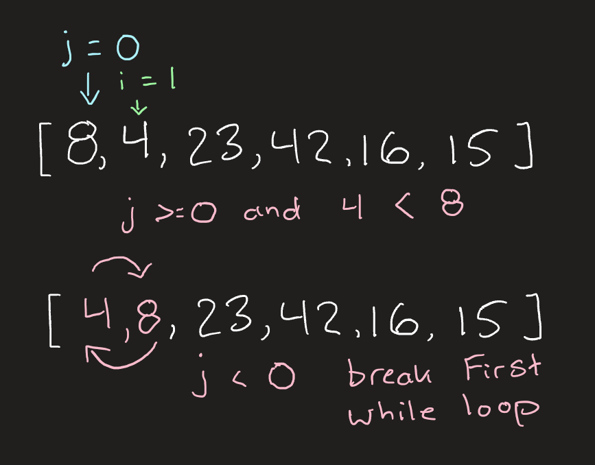
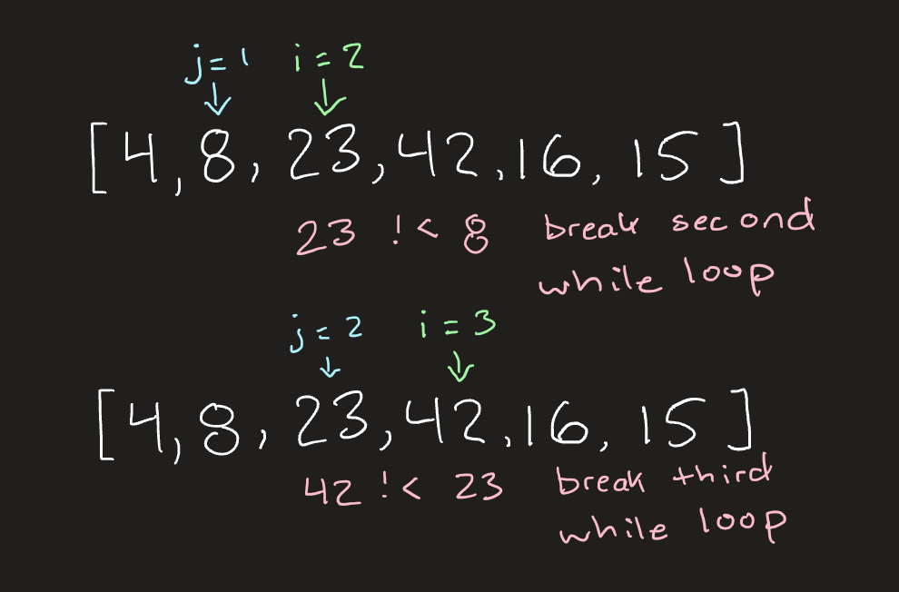
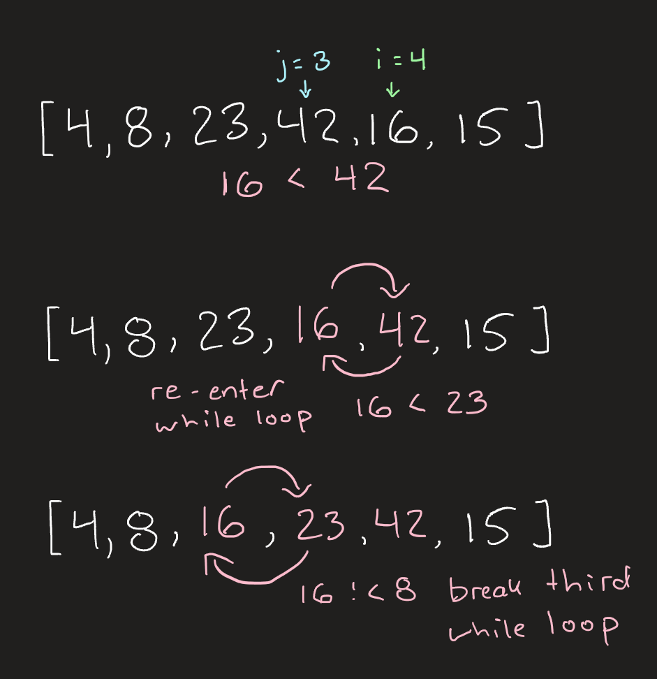
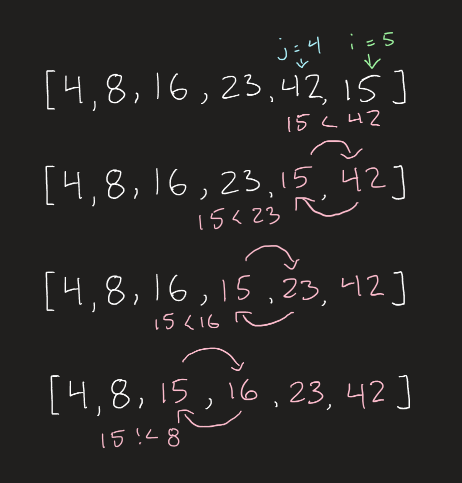

# `InsertionSort()` Blog

Insertion Sort is a method that takes in an array of integers, and sorts them in place by ascending value.  We accomplish this by going through the array and comparing each value to it's previous.  As we progress through the list each value will compare itself it all previous values one by swapping the larger forward.


## Pseudocode
```
InsertionSort(int[] arr)

  FOR i = 1 to arr.length
    int j <-- i - 1
    int temp <-- arr[i]

    WHILE j >= 0 AND temp < arr[j]
      arr[j + 1] <-- arr[j]
      j <-- j - 1
    
    arr[j + 1] <-- temp
```
## Trace

input => `[ 8, 4, 23, 42, 16, 15 ]`

We drop into the first for loop which iterates over the array.  During each iteration we are going to compare the current index to the one before it, if the left value is greater we move swap the values.




After the first while loop finishes the outer for loop will iterate and we'll do the same thing for the next value.



23 and 42 are already in ascending order so the while loop never runs during these iterations and nothing changes in our original array.

Our next iteration while looks a little different.



During this iteration of the for loop we iterate twice through the while loop.  First time being when 16 is compared to 42, and then again when 16 is compared to 23.  Once we reach 8 the condition is no longer met and the loop breaks.

The next, and last, iteration is similar to this one except that the while loop is going to iterate three times effectively moving the value to left three spaces.




The while loop finishes when we hit 8 and the conditional is false.  Then the for exits and our array has been sorted in ascending order by value.

output => `[ 4, 8, 15, 16, 23, 42 ]`

## Efficiency
+ Time: This will iterate over an array giving us a time of n.  Each iteratation of the array will also have a while loop iterating an unknown number of times giving us another nested n, making the time `O(N^2)`
+ Space: The array is sorted in place and no new memory is used giving us `O(1)` for space.

---

<br>


[back to main](../../README.md#insertionsort)
