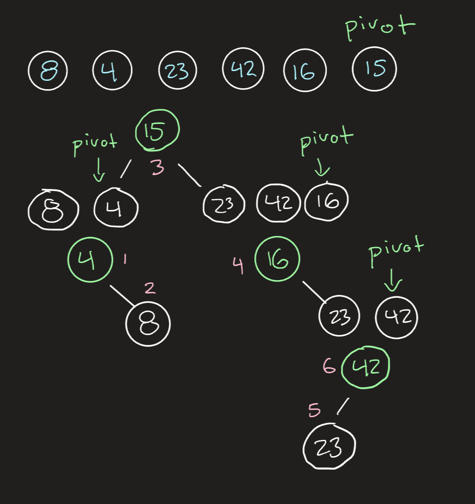

# `QuickSort()`

Quick Sort is a sorting algorithm that takes an unsorted List and chooses a pivot point.
It then partitions(sorts) the list into 2 parts, where values smaller than the pivot value are moved to the left of it, and the greater values are moved to the right.  It continues this process, moving the pivot and left/right pointers until the list is sorted.

---

## __Pseudocode__

```
ALGORITHM QuickSort(arr, left, right)
    if left < right
        DEFINE position <-- Partition(arr, left, right)
        QuickSort(arr, left, position - 1)
        QuickSort(arr, position + 1, right)


ALGORITHM Partition(arr, left, right)
    DEFINE pivot <-- arr[right]
    DEFINE low <-- left - 1
    for i <- left to right do
        if arr[low] <= pivot
            low++;
            DECLARE temp <-- arr[low];
            arr[low] <-- arr[i];
            arr[i] <-- temp;
    
    DECLARE temp2 <-- arr[low + 1];
    arr[low + 1] <-- arr[right];
    arr[right] <-- temp2;    
     
    return low + 1
```
---

## Trace



---

## Efficiency
  * Time: O(Nlogn)
    * BigO time for quick sort is O(n*Log n) because it divide the array into halves and sorting happens as the halves are brought back together.
  * Space: O(n)
    * BigO space for merge sort is O(1) because we are not making anything new.

[back to main](../../README.md#quicksort)