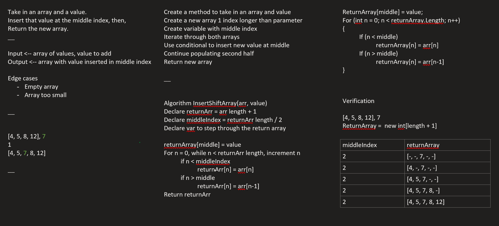

# Data Structures and Algorithms
## Language: `C#`

# Reverse an Array
Reverse array code challenge.

## Challenge
Write a method to reverse an array without using any built in libraries or methods.

## Approach & Efficiency
I'm using a while loop to iterate over the array, swapping the first and last indexes moving inwards.  Iteration stops when it reaches the center of the array.

## Solution

# Insert Shift Array
insert a value into the middle index of an array

## Challenge
Take in an array and a value.  Insert that value into the middle index of the array and return the new array without using built in methods.

## Approach & Efficiency
I created a second array one index longer than the argument.  Found the center based on length, then dropped the input value in the middle index.  Then I iterated over the new array and using conditionals populating the first half and second half based on the mid point.

## Solution

  
[Return to Main Page](../README.md)
